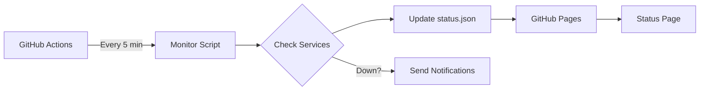

# Shadow Status

A lightweight, fully static status page platform designed for GitHub Pages. Monitor your services, manage incidents, and keep your users informed — all without a database or backend server.

## Features

- **Fully Static** — Deploys directly to GitHub Pages with zero server requirements
- **9 Monitor Types** — HTTP, Ping, TCP, DNS, JSON, StatusPage, Steam, Minecraft, and Manual
- **GitHub-Integrated Incidents** — Manage incidents, maintenance windows, and announcements via GitHub Issues
- **Discord & Webhook Notifications** — Get alerted when services go down or recover
- **90-Day Uptime History** — Track historical performance with visual charts
- **Customizable Design** — Configure branding, colors, and layout to match your style
- **Grouped Monitors** — Organize services into collapsible groups

## Tech Stack

| Category      | Technologies                                   |
| ------------- | ---------------------------------------------- |
| Frontend      | Svelte 5, SvelteKit, Tailwind CSS 4, daisyUI 5 |
| Build         | Vite, SvelteKit Static Adapter                 |
| Hosting       | GitHub Pages                                   |
| Monitoring    | Node.js scripts via GitHub Actions             |
| Notifications | Discord Webhooks, Generic Webhooks             |

## How It Works

1. **GitHub Actions** runs the monitor script every 5 minutes
2. The script checks all configured monitors (HTTP endpoints, servers, etc.)
3. Results are saved to `status.json` and committed to the repository
4. GitHub Pages serves the static site with live status data
5. If a service goes down, notifications are sent via Discord or webhooks

---

## FAQ

### Is this really free to host?

Yes! Shadow Status is designed to run entirely on GitHub Pages (free) with GitHub Actions (free tier includes 2,000 minutes/month). For a status page checking every 5 minutes, you'll use about 1,440 minutes/month — well within the free tier.

### Do I need a server or database?

No. Shadow Status is fully static. All data is stored in JSON files within your repository. GitHub Actions handles the monitoring, and GitHub Pages hosts the site.

### How often are monitors checked?

By default, every 5 minutes via the GitHub Actions cron schedule. You can adjust this in `.github/workflows/monitor-checks.yml`.

### Can I monitor internal/private services?

Only if they're accessible from GitHub's Actions runners (public internet). For internal services behind a firewall, you'd need to expose them or use a different monitoring approach.

### How do I report an incident?

Create a GitHub Issue in your repository with the `incident` label. The status page will automatically display it. See the [Incidents guide](./shadowStatus/incidents) for details.

### Can I use a custom domain?

Yes! Add a `CNAME` file to your `static/` folder with your domain, then configure your DNS to point to GitHub Pages. See [GitHub's custom domain documentation](https://docs.github.com/en/pages/configuring-a-custom-domain-for-your-github-pages-site).

### What happens if GitHub Actions fails?

The status page will continue to show the last known status. The "Last Updated" timestamp will indicate stale data. Consider monitoring your status page itself using an external service.

### How do I hide sensitive URLs?

Set `"showTarget": false` on any monitor to hide its target URL from the public status page. The monitoring still works; the URL just isn't displayed.\
Just remember this is a public repo, so anyone can access the `monitors.json`.
