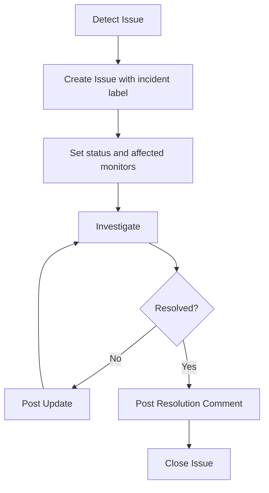
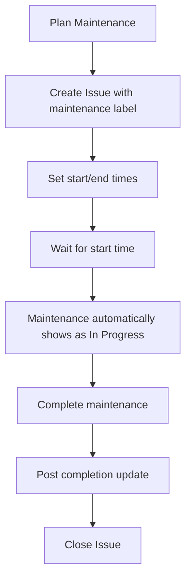

# Incidents & Maintenance

Shadow Status uses GitHub Issues to manage incidents, maintenance windows, and announcements. This integration makes it easy to communicate with your users without any additional tools.

## Overview

| Type          | Label         | Purpose                          |
| ------------- | ------------- | -------------------------------- |
| Incident      | `incident`    | Report and track service outages |
| Maintenance   | `maintenance` | Schedule planned downtime        |
| Announcement  | `announce`    | Display informational notices    |
| Manual Status | `manual`      | Override monitor status manually |

:::tip
Create these labels in your GitHub repository before using them. Go to **Issues** > **Labels** > **New label**.
:::

---

## Incidents

Incidents are displayed prominently on your status page to inform users about ongoing issues.

### Creating an Incident

1. Go to your repository's **Issues** tab
2. Click **New issue**
3. Add a descriptive title (e.g., "API experiencing high latency")
4. Write the incident description in the body
5. Add the `incident` label
6. Click **Submit new issue**

The incident will immediately appear on your status page.

### Targeting Specific Monitors

By default, incidents appear as general notices. To associate an incident with specific monitors or groups, add targeting comments in the issue body:

```markdown
<!-- monitors: API, Database, Auth Service -->
<!-- groups: Infrastructure -->

We're investigating elevated error rates affecting our API services.
```

**Targeting syntax:**

| Comment                           | Description                                               |
| --------------------------------- | --------------------------------------------------------- |
| `<!-- monitors: Name1, Name2 -->` | Target specific monitors by name                          |
| `<!-- monitors: API * -->`        | Wildcard matching (matches "API Gateway", "API v2", etc.) |
| `<!-- groups: GroupName -->`      | Target all monitors in a group                            |

When an incident targets monitors, those monitors will show the incident's status level instead of their check results.

### Setting Incident Severity

Add a status comment to set the severity level:

```markdown
<!-- status: major -->

We're experiencing a complete outage of our payment processing system.
```

Available status levels:

- `operational` - Issue resolved (or informational)
- `degraded` - Performance issues
- `partial` - Some functionality unavailable
- `major` - Complete service outage
- `maintenance` - Planned maintenance

### Posting Updates

Add comments to the issue to post updates. Each comment becomes an update entry on the status page.

```markdown
**Update:** We've identified the root cause and are implementing a fix.
```

### Resolving an Incident

Simply **close the issue** to mark the incident as resolved. It will move to the "Recent Incidents" section (if enabled in your config).

---

## Maintenance Windows

Schedule maintenance windows to inform users about planned downtime.

### Creating a Maintenance Window

1. Create a new issue
2. Add the `maintenance` label
3. Specify start and end times in the body:

```markdown
<!-- start: 2024-02-15 14:00 -->
<!-- end: 2024-02-15 16:00 -->
<!-- monitors: Database, API -->

We'll be performing scheduled database maintenance. Expect brief service interruptions.
```

### Date Formats

Shadow Status supports multiple date formats:

```markdown
<!-- start: 2024-02-15 14:00 -->
<!-- start: 2024-02-15T14:00:00Z -->
<!-- start: Feb 15, 2024 2:00 PM -->
```

:::note
Times are interpreted in UTC unless a timezone is specified.
:::

### Maintenance States

| State           | Description                                      |
| --------------- | ------------------------------------------------ |
| **Upcoming**    | Start time is in the future                      |
| **In Progress** | Current time is between start and end            |
| **Ended**       | End time has passed (close the issue to archive) |

Upcoming maintenance windows appear in a separate section on the status page. When maintenance begins, targeted monitors automatically show "Under Maintenance" status.

---

## Announcements

Announcements are informational notices that don't indicate an outage.

### Creating an Announcement

1. Create a new issue
2. Add the `announce` label
3. Write your announcement:

```markdown
We've launched a new API version! Check out the [migration guide](https://docs.example.com/v2).
```

Announcements appear at the top of the status page. Close the issue to remove it.

### Announcement Display Options

Configure how announcements appear in `config.json`:

```json
{
	"design": {
		"announcement": {
			"showIcon": true,
			"showTitle": true,
			"showCommentAuthor": false,
			"showGithubLink": true
		}
	}
}
```

---

## Manual Monitor Status

Override a monitor's automated status using GitHub Issues.

### Setting Manual Status

1. Create a new issue
2. Set the **title** to the exact monitor name
3. Add the `manual` label
4. Specify the status in the body:

```markdown
<!-- status: degraded -->

We're aware of intermittent connectivity issues and are working on a resolution.
```

### Example

For a monitor named "External Payment Gateway":

**Issue Title:** `External Payment Gateway`

**Issue Body:**

```markdown
<!-- status: partial -->

Our payment provider is experiencing issues. Some transactions may fail.
```

### Returning to Normal

Close the issue to return the monitor to its automated status (operational if checks pass).

---

## Workflow Examples

### Typical Incident Flow



### Scheduled Maintenance Flow


